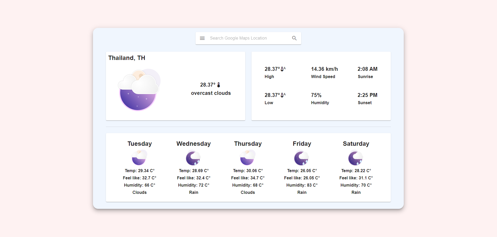

## Overview

This is a modern **ReactJS** weather application that allows users to search for weather data by location. It uses **Axios** for fetching data from the **OpenWeather API**, providing users with up-to-date weather information. The UI is built using **Material-UI** for a sleek, user-friendly experience, and **Lottie Files** animations are integrated for engaging data visualizations.

## Features

- **Current Weather**: View real-time weather conditions for any location.
- **5-Day Forecast**: Get weather forecasts for the next five days, updated every 3 hours.
- **Wind and Humidity**: See the current wind speed and humidity levels.
- **Temperature Tracking**: Check temperatures in Celsius or Fahrenheit.
- **User-Friendly Interface**: Built with Material-UI for smooth interaction and beautiful design.

## Tech Stack

- **ReactJS**: For building the user interface.
- **Axios**: For fetching weather data from the OpenWeather API.
- **Material-UI**: For creating responsive layouts, cards, and inputs.
- **Lottie Files**: For beautiful, animated visualizations of weather data.
- **OpenWeather API**: Free-tier API for accessing weather information.

## Getting Started

### 1. Clone the Repository

```bash
git clone https://github.com/YakirBar/Weather-Application-Project.git
```

### 2. Set Up OpenWeather API

1. Visit [OpenWeather](https://openweathermap.org)
2. Create an account and navigate to **My API keys**
3. Generate a new API key
4. Copy the key and save it in a `.env` file in the root of the project as:
   ```bash
   REACT_APP_API_KEY=your-api-key-here
   ```

### 3. Run the React.js Weather Application

1. Navigate to the application directory:
   ```bash
   cd /Weather-Application-Project/app
   ```
2. Install the dependencies:
   ```bash
   npm install
   ```
3. Ensure port 3000 is available.
4. Start the application:
   ```bash
   npm start
   ```
5. Open your browser and go to `http://localhost:3000`.




## Enjoy!

Enjoy your fully functional weather application. Feel free to fork the repository and submit pull requests for any improvements or new features!